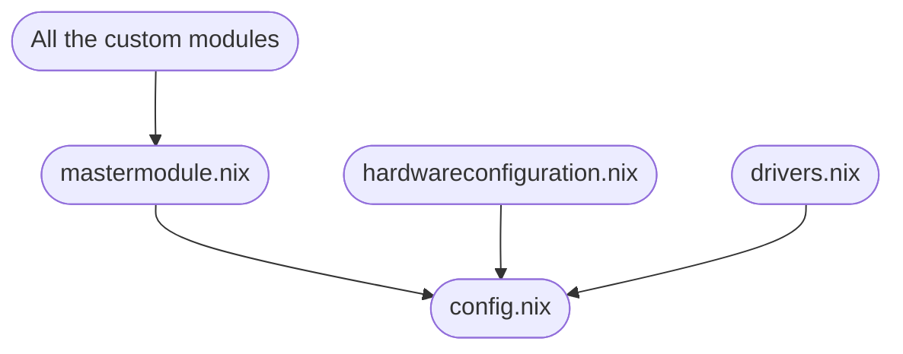

To install the configuration go into the directory and run
```bash
nix-shell -p git
```
```bash
sudo nixos-rebuild switch --flake --impure
```



Todo
- Check if modules can be overriden
- Change the configuration structure to the one represetnted on the flowchart
